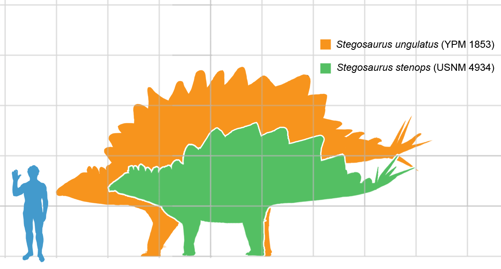

# Steganography Lib

[](http://godoc.org/github.com/auyer/steganography) [](https://goreportcard.com/report/github.com/auyer/steganography) [](https://img.shields.io/badge/license-MIT-brightgreen.svg) [](https://travis-ci.org/auyer/steganography) [](https://cover.run/go?tag=golang-1.10&repo=github.com%2Fauyer%2Fsteganography)

Steganography is a library written in Pure go to allow simple LSB steganography on images. It is capable of both encoding and decoding images. It can store files of any format.
This library is inspired by [Stego by EthanWelsh](https://github.com/EthanWelsh/Stego), a command line utility with the same purpose.

## Installation
```go
go get -u github.com/auyer/steganography
```

## Demonstration

| Original        | Encoded           |
| -------------------- | ------------------|
|  | 
|   79,955 bytes       |   80,629 bytes   |

The second image contains the first paragaph of the description of a stegosaurus on [Wikipidia](https://en.wikipedia.org/wiki/Stegosaurus), also available in [examples/message.txt](examples/message.txt) as an example.

------
Getting Started
------
```go
package main
import (
    "bufio"
    "image"
    "io/ioutil"

    "github.com/auyer/steganography"
)
```

Encode
------
Write mode is used to take a message and embed it into an image file using LSB steganography in order to produce a secret image file that will contain your message.

```go
inFile, _ := os.Open(file_path)  // reads the File
img, _, err := image.Decode(reader) // Decodes image
encodedImg := steganography.EncodeString(message, img) // Encode the message into the provided image file
outFile, _ := os.Create(pictureOutputFile) // Creates the new file
bufio.NewWriter(outFile).Write(encodedImg.Bytes()) // writes file into disk
```

Size of Message
------
Length mode can be used in order to preform a preliminary check on the carrier image in order to deduce how large of a file it can store.

```go
sizeOfMessage := steganography.GetSizeOfMessageFromImage(img) // retrieves the size of the encoded message
```

Decode
-----
Read mode is used to read an image that has been encoded using LSB steganography, and extract the hidden message from that image.

```go
inFile, _ := os.Open(file_path)  // reads the File
img, _, err := image.Decode(bufio.NewReader(inFile)) // Decodes image
sizeOfMessage := steganography.GetSizeOfMessageFromImage(img) // retrieves the size of the encoded message

msg := steganography.DecodeMessageFromPicture(4, sizeOfMessage, img) // Decodes the message from file
```

Open Image From Path
-----
If you do not want to deal with opening the image file in your code, there is a helper function for you. It will do the dirty job and return the image in a way usable by the encode and decode fucntions.
```go
img, err := OpenImageFromPath(imagePath)
if err != nil {
    log.Printf("Error opening or Decoding file %s: %v", imagePath, err)
}
```

Complete Example
------
For a complete example, see the [examples/stego.go](examples/stego.go) file. It is a command line app based on the original fork of this repository, but modifid to use the Steganography library.

-----
### Attributions
 - Stegossaurus Picture By Matt Martyniuk - Own work, CC BY-SA 3.0, https://commons.wikimedia.org/w/index.php?curid=42215661
